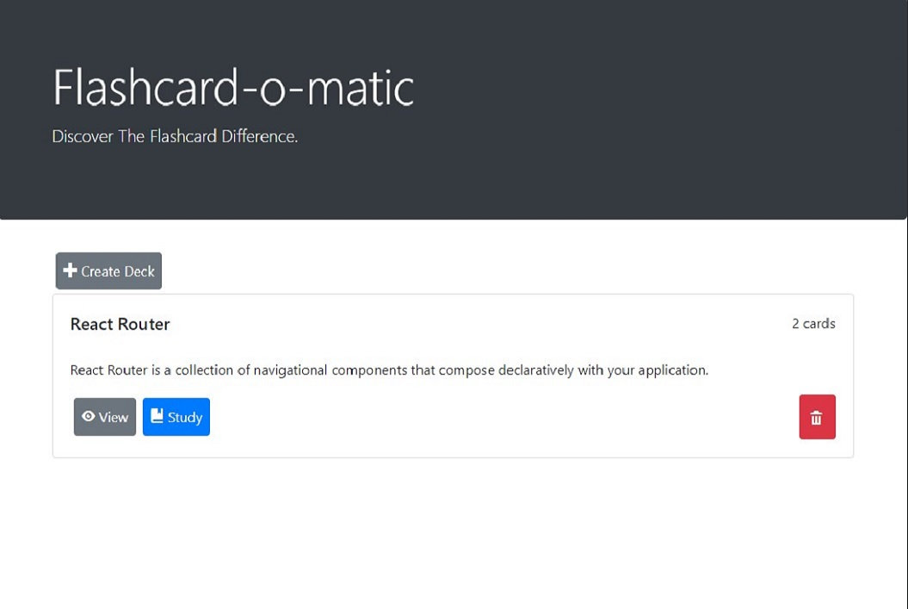

# Flashcard Study App

For this project, I had to build a React App that uses an API to create, read, update, and delete records stored by the API. 



## Project Details

Thinkful project designed to test ability to work with rendering and state management using React. To run locally, download and run ```npm install``` and ```npm run start```. 

**Technical Skills/Tools Used:**  
JavaScript, React, NodeJS, Bootstrap, Jest, HTML, CSS  

## Project Objectives  
    
**From Thinkful project description:**  
 - Using hooks like useState(), useParams(), and useHistory()
 - Debugging React code through console output and using the VS Code debugger
 - Writing React function components
 - Creating routes, including nested routes, using React Router
